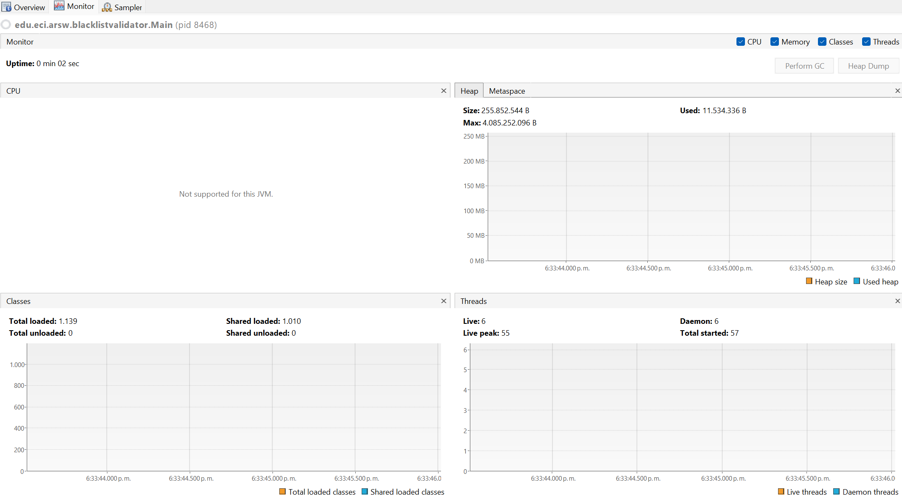

# Escuela Colombiana de Ingeniería
# Arquitecturas de Software - Laboratorio 1 

[](https://www.oracle.com/java/)
[](https://maven.apache.org/)

## Descripción

Este proyecto es un laboratorio académico de la Escuela Colombiana de Ingeniería Julio Garavito para la materia Arquitecturas de Software (ARSW). El objetivo es explorar y comparar el desempeño de algoritmos secuenciales y paralelos en Java, usando el caso de búsqueda de direcciones IP en listas negras (BlackList Search) y el manejo de hilos (Threads).

## Herramientas y Lenguajes Utilizados

- **Lenguaje:** Java 17 o superior
- **Build Tool:** Maven
- **IDE recomendada:** IntelliJ IDEA, Eclipse, VS Code o NetBeans
- **Monitor de desempeño:** VisualVM
- **Sistema Operativo:** Windows, Linux o macOS

## Estructura del Proyecto

- `src/test/java/edu/eci/arsw/threads/` - Parte 1 del laboratorio, introducción a threads
- `src/main/java/edu/eci/arsw/blacklistvalidator/` - Parte 2 del laboratorio
- `src/main/java/edu/eci/arsw/spamkeywordsdatasource/` - Fachada de acceso a listas negras (no modificable)
- `src/test/java/edu/eci/arsw/math/` - Pruebas unitarias
- `img/` - Diagramas y capturas de pantalla

## Cómo Ejecutar el Proyecto

### 1. Clonar el repositorio

```bash
git clone https://github.com/Juan-Jose-D/ARSW-Laboratorio1.git
cd ARSW-Laboratorio1
```

### 2. Compilar el proyecto

```bash
mvn clean compile
```

### 3. Ejecutar el programa principal

Puedes ejecutar el programa desde la terminal usando:

```bash
mvn exec:java
```

Esto ejecutará el ejercicio de la parte 2 del laboratorio.
Puedes agregarle estos argumentos opcionales:

- `<ip>`: (opcional) Dirección IP a buscar. Por defecto: `200.24.34.55`
- `<numHilos>`: (opcional) Número de hilos a usar. Por defecto: `4`

Ejemplo:

```bash
 mvn exec:java "-Dexec.args=202.24.34.55 8"
```

Para ejecutar la parte 1 del laboratorio, usa este comando de java directo en vez de maven:

```bash
java -cp target\classes edu.eci.arsw.threads.CountThreadsMain
```


### 4. Monitorear el desempeño (opcional)

Abre **VisualVM** y selecciona el proceso Java correspondiente para observar el uso de CPU y memoria durante la ejecución de las pruebas.

---


## Ejercicio del laboratorio

Laboratorio: https://github.com/ARSW-ECI/PARALLELISM-JAVA_THREADS-INTRODUCTION_BLACKLISTSEARCH

### Desarrollo

**Parte I - Introducción a Hilos en Java**

En la clase CountThread extendemos la clase Thread para que funcione como un hilo y creamos la implementación para que imprima los números de un rango dado.
Y en la clase CountThreadMain creamos los hilos con los rangos del ejercicio y ejecutamos los hilos con start o run.

```java
public class CountThread extends Thread { 
    Thread t;
	int inicio;
	int fin;
	
	public CountThread(int A, int B) {
		inicio = A;
		fin = B;
		t = new Thread(this, "nuevo hilo");
	}

    @Override
	public void run() {
		long starttime = System.nanoTime();
		for (int contador = inicio;contador<=fin;contador++) {
			System.out.println(contador);
		}
		long endtime = System.nanoTime();
		System.out.println("tiempo: "+(starttime-endtime));     
	}	
}

public class CountThreadsMain{
    
    public static void main(String a[]){
        CountThread thread = new CountThread(0,99);
        CountThread thread2 = new CountThread(99,199);
        CountThread thread3 = new CountThread(200,299);
        thread.start();
        thread2.start();
        thread3.start();
    } 
}
```

En este caso cuando lo ejecuto con start los numeros se imprimen de forma desordenada por lo que los hilos trabajan en paralelo, mientras que con run si se imprimen de forma ordenada.
Esto sucede porque start() es el método que realmente inicia el hilo, permitiendo que el código dentro del método run() se ejecute en paralelo mientras que run() no crea un nuevo contexto de ejecución, simplemente ejecuta el código como una llamada de método normal.

**Parte II - Ejercicio Black List Search**


Para un software de vigilancia automática de seguridad informática se está desarrollando un componente encargado de validar las direcciones IP en varios miles de listas negras (de host maliciosos) conocidas, y reportar aquellas que existan en al menos cinco de dichas listas. 

Dicho componente está diseñado de acuerdo con el siguiente diagrama, donde:

- HostBlackListsDataSourceFacade es una clase que ofrece una 'fachada' para realizar consultas en cualquiera de las N listas negras registradas (método 'isInBlacklistServer'), y que permite también hacer un reporte a una base de datos local de cuando una dirección IP se considera peligrosa. Esta clase NO ES MODIFICABLE, pero se sabe que es 'Thread-Safe'.

- HostBlackListsValidator es una clase que ofrece el método 'checkHost', el cual, a través de la clase 'HostBlackListDataSourceFacade', valida en cada una de las listas negras un host determinado. En dicho método está considerada la política de que al encontrarse un HOST en al menos cinco listas negras, el mismo será registrado como 'no confiable', o como 'confiable' en caso contrario. Adicionalmente, retornará la lista de los números de las 'listas negras' en donde se encontró registrado el HOST.


Al usarse el módulo, la evidencia de que se hizo el registro como 'confiable' o 'no confiable' se dá por lo mensajes de LOGs:

INFO: HOST 205.24.34.55 Reported as trustworthy

INFO: HOST 205.24.34.55 Reported as NOT trustworthy


Al programa de prueba provisto (Main), le toma sólo algunos segundos análizar y reportar la dirección provista (200.24.34.55), ya que la misma está registrada más de cinco veces en los primeros servidores, por lo que no requiere recorrerlos todos. Sin embargo, hacer la búsqueda en casos donde NO hay reportes, o donde los mismos están dispersos en las miles de listas negras, toma bastante tiempo.

Éste, como cualquier método de búsqueda, puede verse como un problema [vergonzosamente paralelo](https://en.wikipedia.org/wiki/Embarrassingly_parallel), ya que no existen dependencias entre una partición del problema y otra.

Para 'refactorizar' este código, y hacer que explote la capacidad multi-núcleo de la CPU del equipo, realice lo siguiente:

1. Cree una clase de tipo Thread que represente el ciclo de vida de un hilo que haga la búsqueda de un segmento del conjunto de servidores disponibles. Agregue a dicha clase un método que permita 'preguntarle' a las instancias del mismo (los hilos) cuantas ocurrencias de servidores maliciosos ha encontrado o encontró.

2. Agregue al método 'checkHost' un parámetro entero N, correspondiente al número de hilos entre los que se va a realizar la búsqueda (recuerde tener en cuenta si N es par o impar!). Modifique el código de este método para que divida el espacio de búsqueda entre las N partes indicadas, y paralelice la búsqueda a través de N hilos. Haga que dicha función espere hasta que los N hilos terminen de resolver su respectivo sub-problema, agregue las ocurrencias encontradas por cada hilo a la lista que retorna el método, y entonces calcule (sumando el total de ocurrencuas encontradas por cada hilo) si el número de ocurrencias es mayor o igual a _BLACK_LIST_ALARM_COUNT_. Si se da este caso, al final se DEBE reportar el host como confiable o no confiable, y mostrar el listado con los números de las listas negras respectivas. Para lograr este comportamiento de 'espera' revise el método [join](https://docs.oracle.com/javase/tutorial/essential/concurrency/join.html) del API de concurrencia de Java. Tenga también en cuenta:

	* Dentro del método checkHost Se debe mantener el LOG que informa, antes de retornar el resultado, el número de listas negras revisadas VS. el número de listas negras total (línea 60). Se debe garantizar que dicha información sea verídica bajo el nuevo esquema de procesamiento en paralelo planteado.

	* Se sabe que el HOST 202.24.34.55 está reportado en listas negras de una forma más dispersa, y que el host 212.24.24.55 NO está en ninguna lista negra.


**Parte II.I Para discutir la próxima clase (NO para implementar aún)**

La estrategia de paralelismo antes implementada es ineficiente en ciertos casos, pues la búsqueda se sigue realizando aún cuando los N hilos (en su conjunto) ya hayan encontrado el número mínimo de ocurrencias requeridas para reportar al servidor como malicioso. Cómo se podría modificar la implementación para minimizar el número de consultas en estos casos?, qué elemento nuevo traería esto al problema?

**Parte III - Evaluación de Desempeño**

A partir de lo anterior, implemente la siguiente secuencia de experimentos para realizar las validación de direcciones IP dispersas (por ejemplo 202.24.34.55), tomando los tiempos de ejecución de los mismos (asegúrese de hacerlos en la misma máquina):

1. Un solo hilo.


2. Tantos hilos como núcleos de procesamiento.  En mi caso 24.


3. Tantos hilos como el doble de núcleos de procesamiento.



4. 50 hilos.

En este caso la herramienta VisualVM no alcanza a tomarlo pero en el main ageregamos una funcionalidad para ver el tiempo que tarda.

```bash
Tiempo de ejecución: 1900 ms
```

5. 100 hilos.
   
```bash
Tiempo de ejecución: 1060 ms
```

Con lo anterior, y con los tiempos de ejecución dados, haga una gráfica de tiempo de solución vs. número de hilos. Analice y plantee hipótesis con su compañero para las siguientes preguntas (puede tener en cuenta lo reportado por jVisualVM):


**Parte IV - Ejercicio Black List Search**

1. Según la [ley de Amdahls](https://www.pugetsystems.com/labs/articles/Estimating-CPU-Performance-using-Amdahls-Law-619/#WhatisAmdahlsLaw?):

	, donde _S(n)_ es el mejoramiento teórico del desempeño, _P_ la fracción paralelizable del algoritmo, y _n_ el número de hilos, a mayor _n_, mayor debería ser dicha mejora. Por qué el mejor desempeño no se logra con los 500 hilos?, cómo se compara este desempeño cuando se usan 200?. 


Con 100 hilos ya casi se alcanza el mejor tiempo posible (1.06 s).
Al poner 200 o 500 hilos, no mejora mucho porque hay demasiados hilos que el procesador no puede manejar al mismo tiempo y se pierde tiempo organizando y repartiendo trabajo entre tantos hilos.

2. Cómo se comporta la solución usando tantos hilos de procesamiento como núcleos comparado con el resultado de usar el doble de éste?


Cuando se usan hilos igual al número de núcleos del procesador, el rendimiento es muy bueno.
Si se duplican los hilos, puede mejorar un poco más, pero después ya casi no baja el tiempo porque los hilos tienen que turnarse y se pierde eficiencia.

1. De acuerdo con lo anterior, si para este problema en lugar de 100 hilos en una sola CPU se pudiera usar 1 hilo en cada una de 100 máquinas hipotéticas, la ley de Amdahls se aplicaría mejor?. Si en lugar de esto se usaran c hilos en 100/c máquinas distribuidas (siendo c es el número de núcleos de dichas máquinas), se mejoraría?. Explique su respuesta.

- 100 hilos en una sola CPU: llega un límite por la capacidad de esa máquina.
- 1 hilo en cada una de 100 máquinas: sería mucho mejor, porque cada máquina tendría su propio procesador trabajando de verdad en paralelo.
- c hilos en 100/c máquinas: también sería mejor que usar todo en una sola máquina, porque cada CPU trabajaría con sus propios núcleos sin sobrecargarse.


**Author**
Juan José Díaz Gómez


